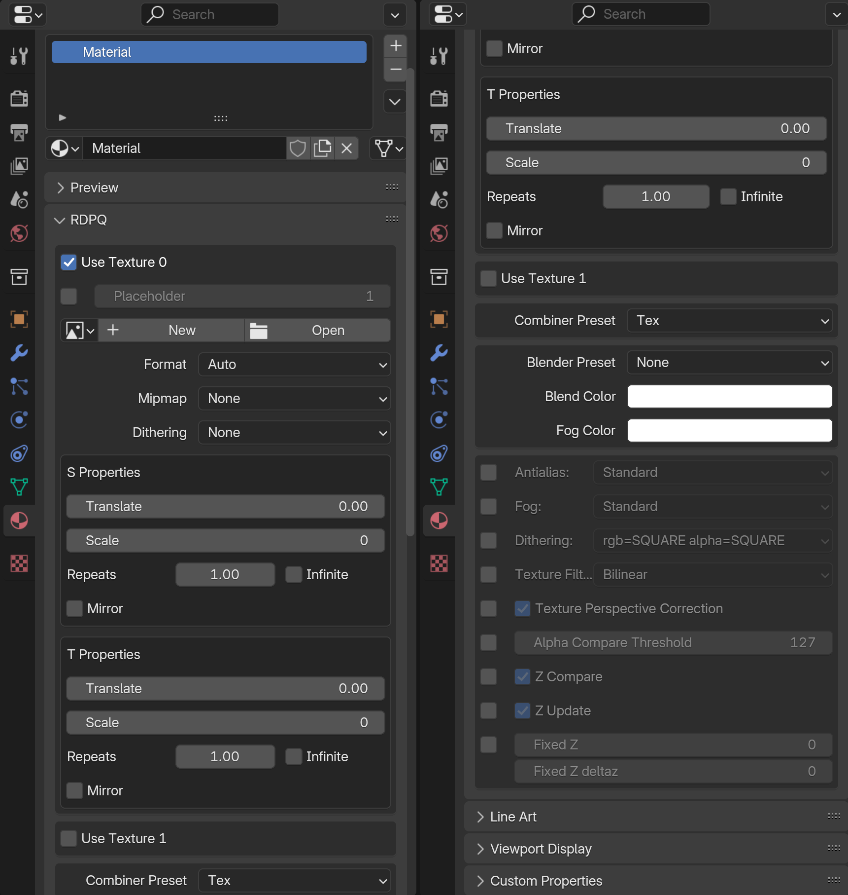
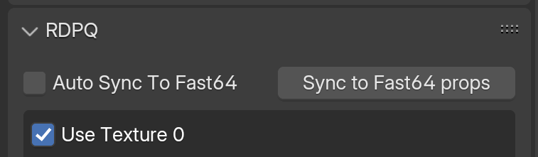
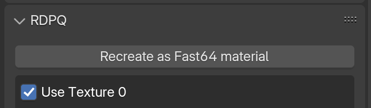
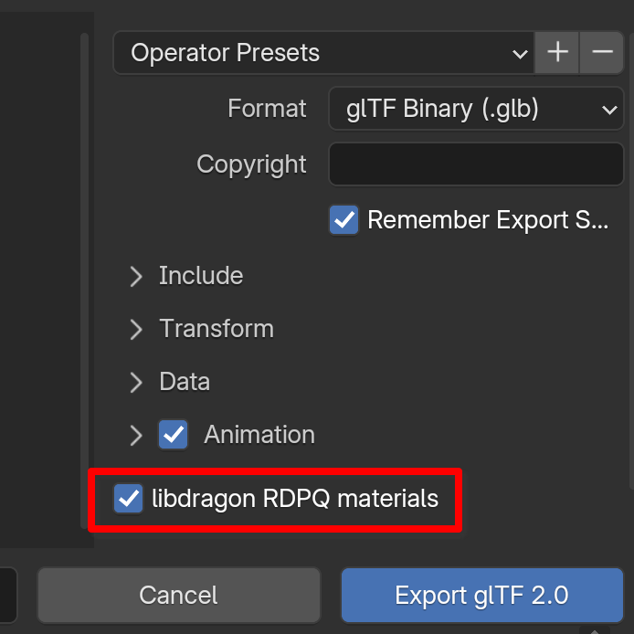

# libdragon-rdpq-materials-blender

This is a [Blender](https://www.blender.org/) addon providing
material properties corresponding to the rdpq materials of the
[libdragon](https://github.com/DragonMinded/libdragon) SDK for Nintendo64
homebrew.

It aims to be compatible with Blender 3.2+.

## Usage

You can find the RDPQ panel in the material properties. The default
looks like this:



The properties are divided in 5 boxes: Texture 0, Texture 1, Combiner,
Blender, and Render Mode Overrides.

## Transfering to Fast64

If the [Fast64](https://github.com/Fast-64/fast64) addon is installed
and enabled, the libdragon-rdpq-materials-blender addon can copy the
properties over to Fast64 properties.

This enables previewing of libdragon RDPQ material properties in Blender.

If the current material is already a Fast64 material, the following options show:



The "Sync to Fast64 props" copies the libdragon RDPQ material properties
over to Fast64 once. The "Auto Sync To Fast64" checkbox can be checked
to do this automatically when a libdragon RDPQ material property is
changed (warning: slow).

If the current material is not a Fast64 material, it needs to be
recreated from scratch as one. The following helper button shows to
achieve this:



Note this "Recreate as Fast64 material" will only conserve the libdragon
RDPQ material properties and no other property of the material.

## glTF extension

This addon includes an extension `EXT_libdragon_rdpq_materials_jmat`
to the glTF exporter, which adds the libdragon RDPQ material properties
to the exported materials. This extension is enabled by default.



## Dev Environment

Formatter: black 26

```bash
python3 -m venv .venv
. .venv/bin/activate
pip install 'black>=26<27'
pip install fake-bpy-module-3.2
ln -s -t ~/.config/blender/4.2/scripts/addons/ $(realpath .)
```
